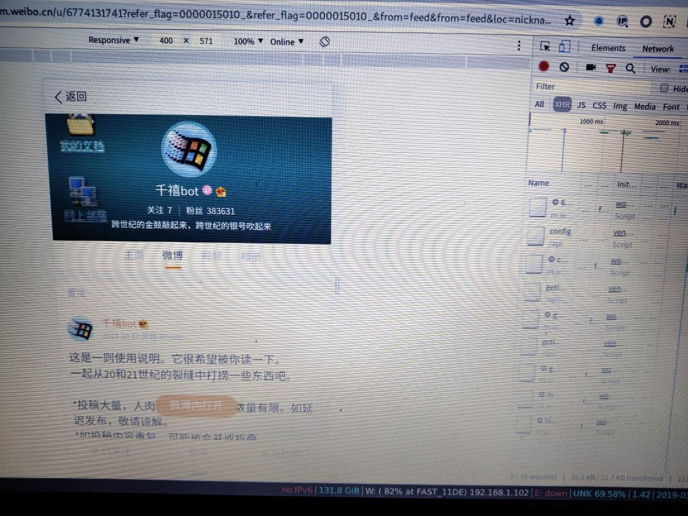
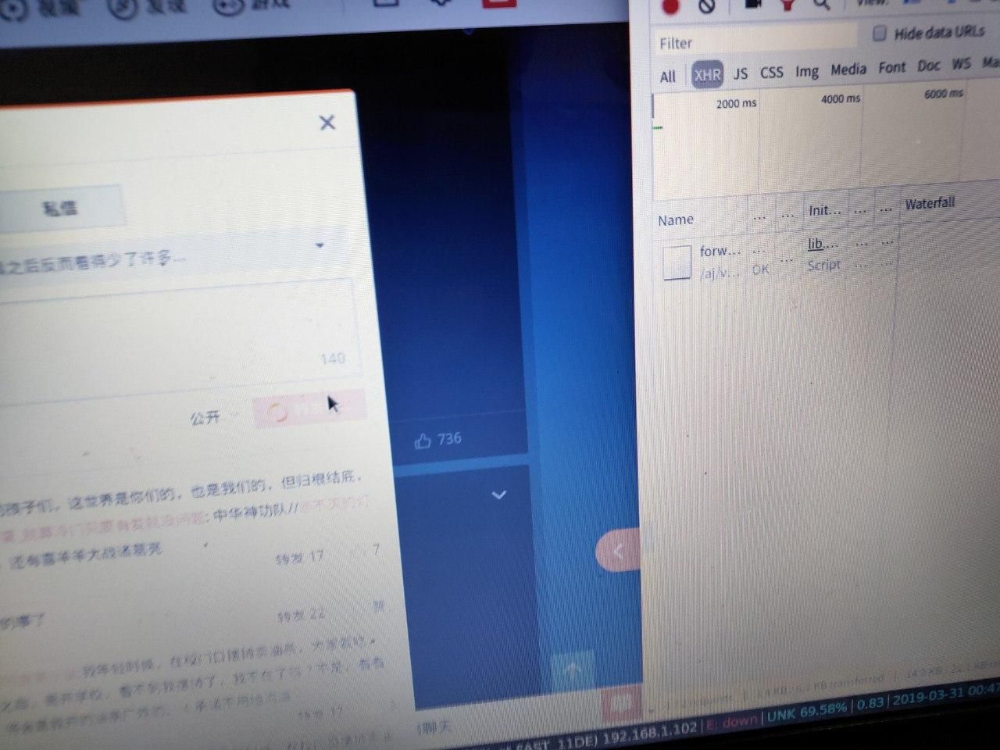

# weibo-prize
微博的转发抽奖脚本,配合crontab使用.

效果如图:


注意点: 从mobile 界面获取用户的相关信息: container id 等, 而从 pc端作模拟登陆和请求转发

mid 是微博的id, reason是转发附加信息, 而username, password 直接填写就好

没有做转发次数测试, 但目前一天两条不会被封, 也不清楚是不是被当成垃圾用户过滤了..


tips: 模拟登陆应该主要是非对称加密麻烦点吧...

.....登陆部分忘了从github哪个大佬那找的了... 希望不要见怪 QAQ


如下图所示，打开开发者工具，切换到手机端并过滤掉非XHR请求，然后刷新一次页面，会发现一个类似下面的请求：


```
m.weibo.cn/api/container/getIndex?uid=1939498534&luicode=10000011&lfid=1076035223052780&type=uid&value=1939498534&containerid=1076031939498534"
```

通过上面的这个请求我们就可以获得你要转发的条目了，也就是能转发哪些微博的id，代码里有，就是那个mid


然后有了mid就是如何转发了，如下图，转发其实差不多应该，从点击转发后的连接可以得到请求，发现就是把mid和分享时说的message直接传递给转发链接。



项目还在改，你可以把用户名密码填上做个测试，最好是按上面说的，登陆微博，然后把上面需要的链接填一遍。

下一步是引入CI，争取能找个免费的自动化部署，省了阿里云的每月十块钱。


